# ProShop E-Commerce Platform

## Project Overview

ProShop is a full-stack **MERN** (MongoDB, Express.js, React, Node.js) e-commerce application with a comprehensive DevOps pipeline, cloud-native infrastructure, and enterprise-grade monitoring stack. The project demonstrates modern software development practices, combining application development with enterprise-level DevOps methodologies, containerization, orchestration, cloud deployment strategies, and observability using **Prometheus** and **Grafana**.


---

## Application Stack

### Frontend

* **React.js** with Redux Toolkit for state management
* **React Router** for client-side routing
* **React Bootstrap** for responsive UI components
* **RTK Query** for efficient data fetching and caching
* **PayPal SDK** integration for payment processing

### Backend

* **Node.js** with Express.js framework
* **MongoDB** with Mongoose ODM
* **JWT** (JSON Web Tokens) for authentication
* **bcrypt.js** for password hashing
* **Multer** for file upload handling
* Cookie-based session management
* **prom-client** for Prometheus metrics exposition

---

## Core Features

* Full shopping cart functionality with persistent storage
* User authentication and authorization (JWT-based)
* Product catalog with search, pagination, and filtering
* Product reviews and rating system
* Admin dashboard for product, user, and order management
* PayPal payment integration
* Order tracking and delivery status management
* Image upload and management system

---

## DevOps Technology Stack

### 1. Containerization

* Docker multi-stage builds for optimized production images
* Docker Compose for local development orchestration
* Layer caching optimization for faster builds
* Production-ready container images with minimal attack surface

### 2. Container Orchestration

* Kubernetes for production-grade orchestration
* StatefulSets for MongoDB and Prometheus with persistent storage
* Deployments for stateless application components
* Services (ClusterIP, NodePort) for networking
* ConfigMaps & Secrets for secure configuration
* Persistent Volume Claims for database and metrics data
* DaemonSets for node-level monitoring (node-exporter)

### 3. Infrastructure as Code (IaC)

* Terraform for AWS infrastructure provisioning:

  * AWS EKS cluster creation
  * VPC with public/private subnets across availability zones
  * NAT Gateways for secure outbound access
  * Security Groups and least-privilege policies
  * IAM Roles & Policies (IRSA)
  * S3 backend for Terraform state management
  * DynamoDB for state locking
  * AWS Load Balancer Controller via Helm
  * EBS volumes for Prometheus & Grafana persistence

### 4. CI/CD Pipeline

* GitLab CI/CD with multi-stage pipeline:

  * Install → Test → Build → Security Scan → Push → Deploy → Notify
  * Dependency caching for faster builds
  * Parallel job execution for frontend and backend
  * Conditional execution (feature branch vs main)
  * Artifact management (Docker images & reports)
  * Automated Kubernetes manifest updates (GitOps style)


  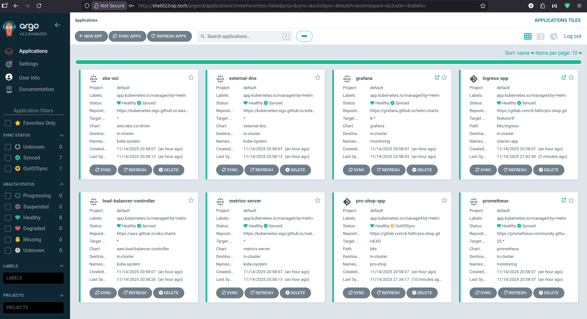 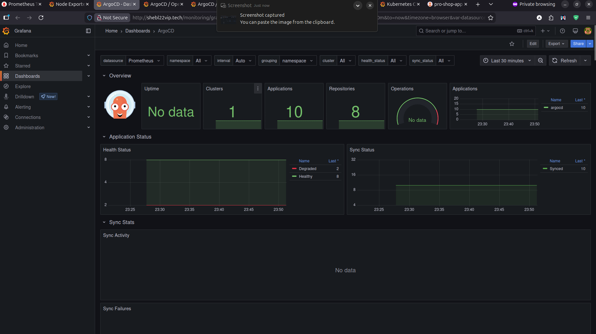 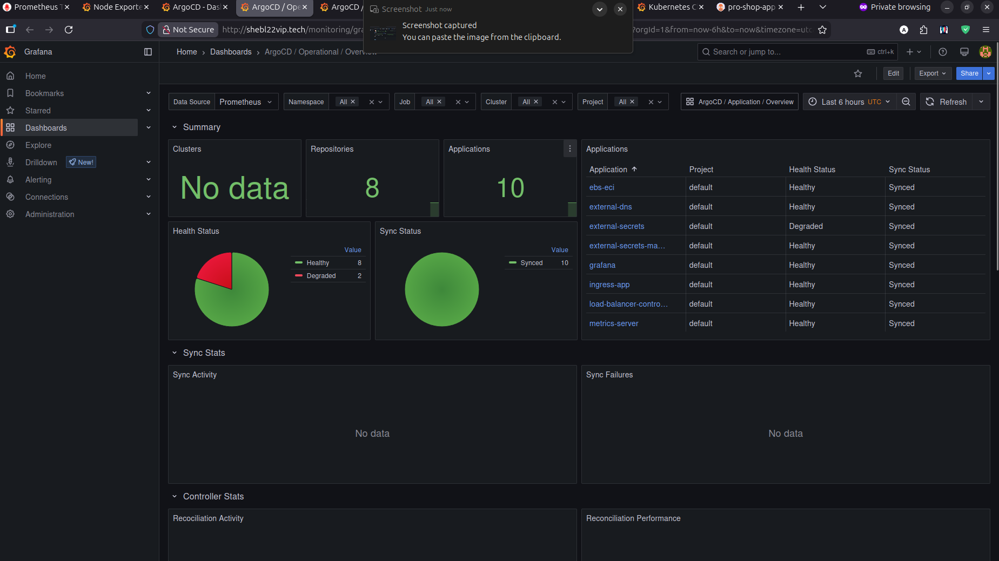  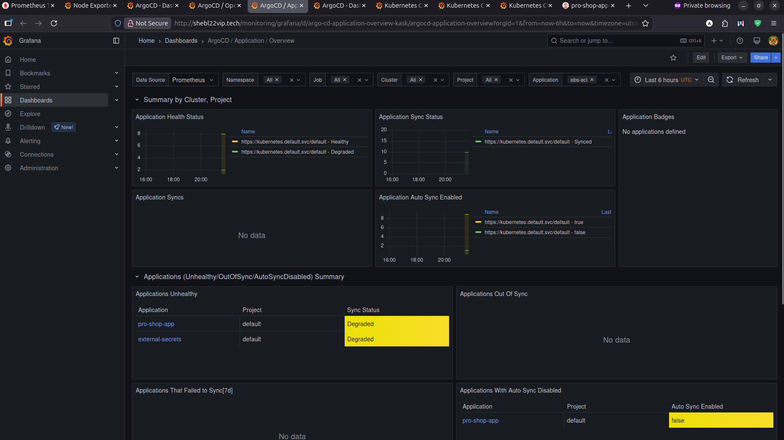

### 5. Security Scanning

* **Trivy**: container vulnerability scanning (image + filesystem)
* **npm audit**: Node.js dependency scanning (frontend & backend)
* **Gitleaks**: secret scanning in repository
* **NJSScan**, **Semgrep**, **Retire.js**, **tfsec** for additional code & IaC security

### 6. Configuration Management

* **Ansible**:

  * Cross-platform deployment (Debian/Ubuntu, RHEL/CentOS/Fedora)
  * Docker installation and configuration
  * Docker Compose stack deployment
  * Idempotent playbooks and environment-specific variables

### 7. Monitoring & Observability

* **Prometheus**:

  * Metrics collection and storage (time-series database)
  * Pull-based model, service discovery
  * PromQL queries and Alertmanager integration
* **Grafana**:

  * Multi-datasource dashboards (Kubernetes, Node exporter, MongoDB)
  * Custom dashboards for application metrics
  * Alerting and GitOps-managed provisioning

--- 

# Running ProShop

The project supports multiple deployment approaches. Select the method that matches your environment and workflow.

---

## 1. Docker Compose (Local Development)

### Steps

```bash
docker compose up -d --build
docker compose logs -f
docker compose down
```

---

## 2. Make Commands (Recommended for Development)

The project includes a comprehensive Makefile for common development tasks.

### Quick Start

```bash
# View all available commands
make help

# Install dependencies
make install

# Build Docker images
make build

# Start all services
make up

# View logs
make logs

# Stop services
make down
```

### Build Commands

```bash
make build              # Build both frontend and backend images
make build-backend      # Build backend image only
make build-frontend     # Build frontend image only
make install            # Install npm dependencies
```

### Test Commands

```bash
make test               # Run all tests
make test-backend       # Run backend tests
make test-frontend      # Run frontend tests
make lint               # Run all linters
make lint-backend       # Run backend linter
make lint-frontend      # Run frontend linter
```

### Docker Compose Commands

```bash
make up                 # Start all services
make down               # Stop all services
make restart            # Restart all services
make logs               # View service logs
make ps                 # Show running containers
make status             # Show detailed status
```

### Cleanup Commands

```bash
make clean              # Remove node_modules and build artifacts
make clean-docker       # Remove Docker containers and images
make clean-cache        # Remove build caches
make destroy            # Full cleanup (all of the above)
```

### Kubernetes Commands

```bash
make k8s-apply          # Apply Kubernetes manifests
make k8s-delete         # Delete Kubernetes resources
```

### Utility Commands

```bash
make shell-backend      # Open shell in backend container
make shell-frontend     # Open shell in frontend container
```

---

## 3. Shell Script Deployment

### Steps

```bash
chmod +x manage_proshop.sh

# Deploy
./manage_proshop.sh deploy
# or
./manage_proshop.sh

# Cleanup
./manage_proshop.sh cleanup
```

---

## 4. Ansible Deployment

### Deploy

```bash
ansible-playbook ansible/deploy.yml -e action=deploy --ask-become-pass
```

### Cleanup

```bash
ansible-playbook ansible/deploy.yml -e action=cleanup --ask-become-pass
```

---

## 5. Helm Deployment

Your Helm chart supports dry-runs, templating, packaging, and installation.

### Preview what would be deployed (dry run)

```bash
helm install my-proshop . --dry-run --debug
```

### Render the full manifest without installing

```bash
helm template my-proshop .
```

### Install into your cluster

```bash
helm install my-proshop .
```

### Check release status

```bash
helm status my-proshop
```

### List all releases

```bash
helm list
```

### Package the chart

```bash
helm package .
```

---

## 6. Kustomize Deployment

### Steps

#### Build and preview the final manifest

```bash
kubectl kustomize k8s/
```

#### Apply the entire stack

```bash
kubectl apply -k k8s/
```

#### Delete the stack

```bash
kubectl delete -k k8s/
```
---

## 7. Terraform Deployment (AWS Infrastructure)

The `terraform/` directory provisions the full AWS infrastructure required for the ProShop production environment (EKS, VPC, IAM, Route53, ALB Controller, ACM certificates, ESO permissions, EBS storage classes, and more).

---

### Prerequisites

* AWS CLI configured (`aws configure`)
* Terraform installed
* S3 bucket + DynamoDB table (if using remote backend in `backend.tf`)
* IAM permissions to provision VPC, EKS, IAM roles, Route53, ACM, etc.

---

### Terraform Workflow

#### Initialize providers, modules, and backend

```bash
terraform init
```

#### Validate the configuration

```bash
terraform validate
```

#### Preview changes

```bash
terraform plan -out tfplan
```

#### Apply and create the infrastructure

```bash
terraform apply tfplan
```

#### Destroy the environment

```bash
terraform destroy
```

---

### Outputs

After provisioning, retrieve important infrastructure details:

```bash
terraform output
```

Typical outputs include:

* EKS cluster name
* Cluster endpoint
* Node group roles
* VPC IDs and subnets
* ARN of ACM certificate
* Route53 hosted zone data

---

## Complete Deployment Flow (Cloud → Kubernetes → App)

1. **Provision AWS infrastructure**

   ```bash
   terraform init
   terraform plan -out tfplan
   terraform apply tfplan
   ```

2. **Update kubectl config to use the new EKS cluster**

   ```bash
   aws eks update-kubeconfig --name <cluster_name> --region <region>
   ```

3. **Deploy application using one of the Kubernetes methods:**

   * Helm (`helm install my-proshop .`)
   * Kustomize (`kubectl apply -k k8s/`)

4. **Monitor through Prometheus/Grafana**

 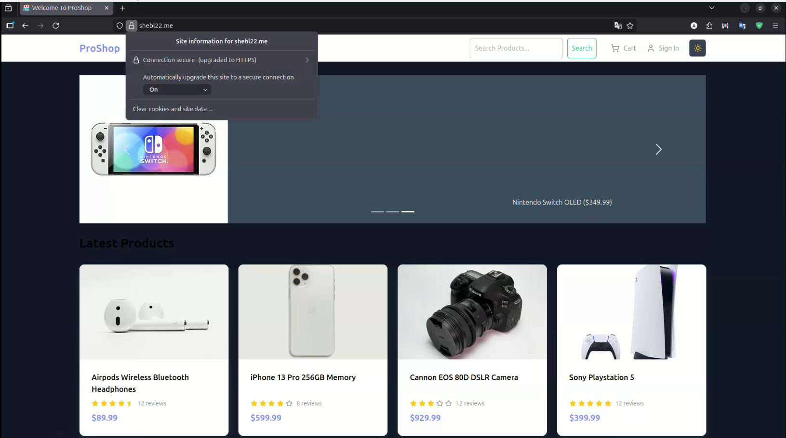 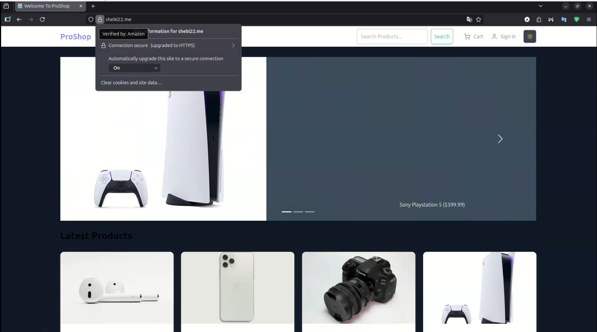 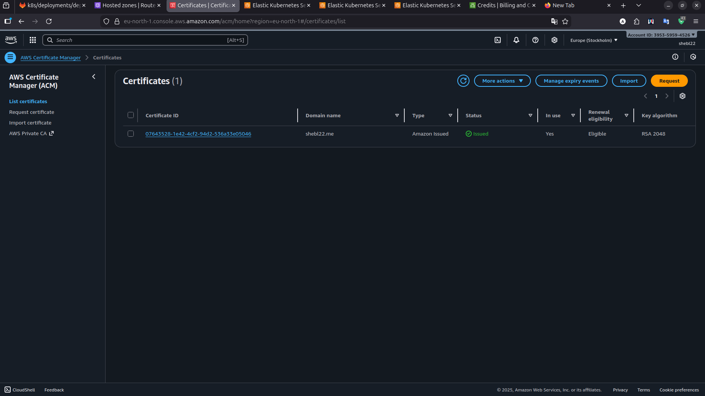 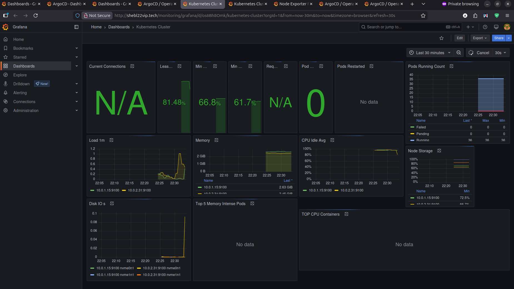 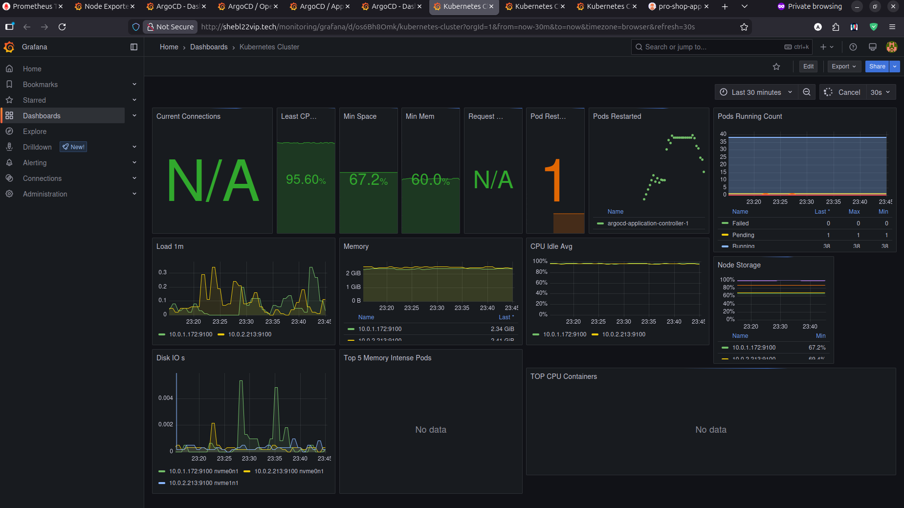 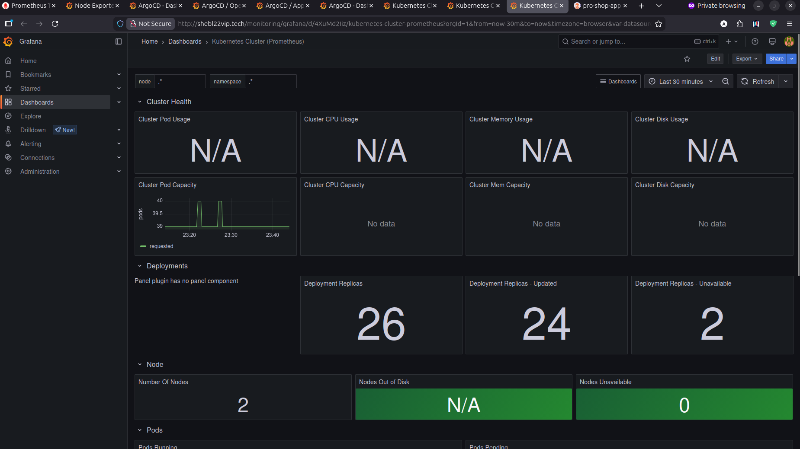 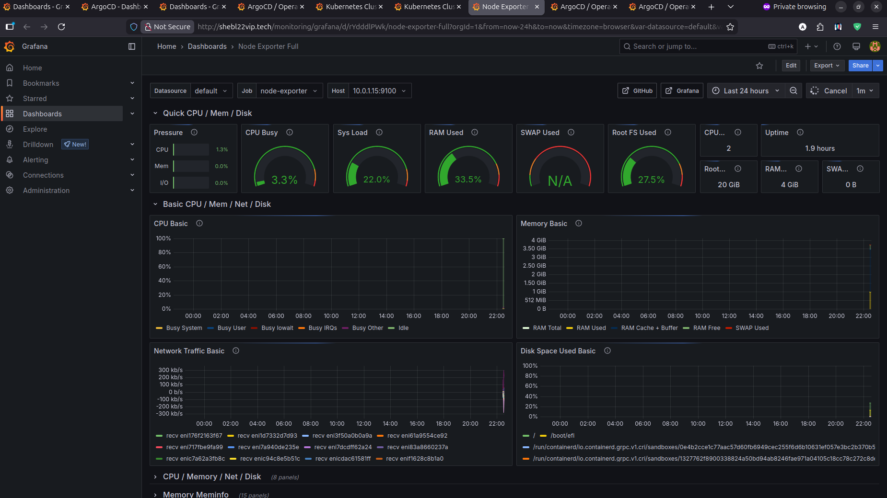 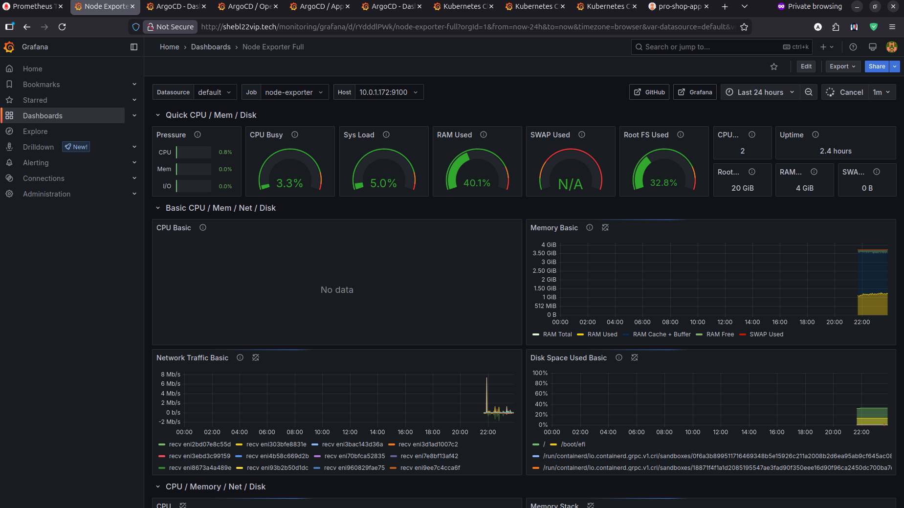 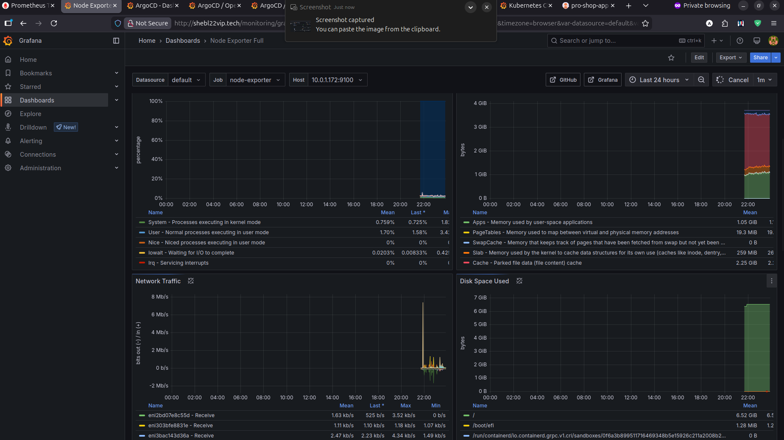 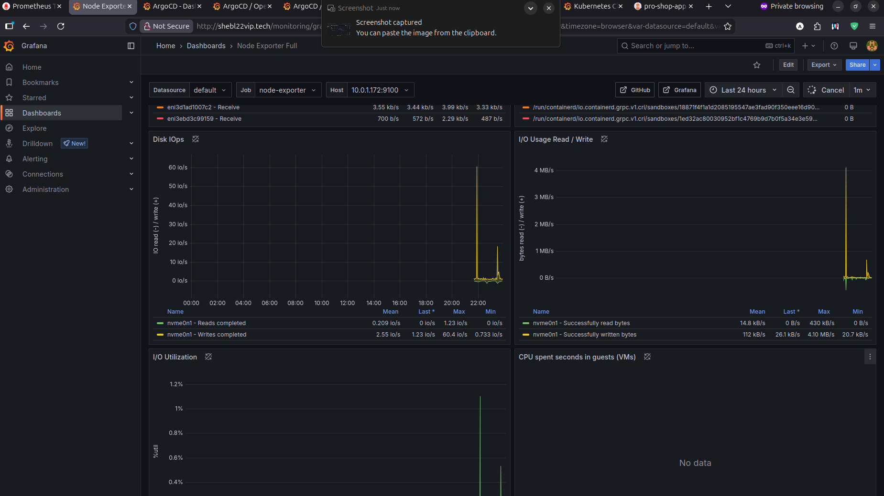